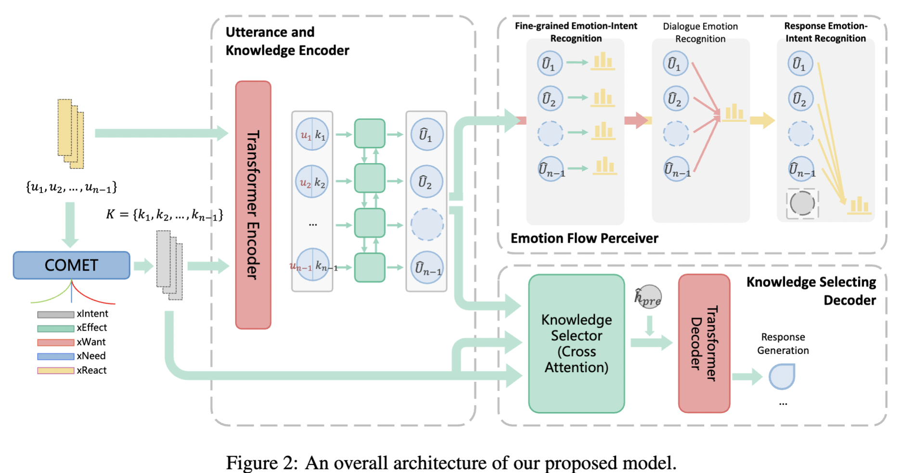

# SEEK
This repository is the implementation of our EMNLP 2022 Paper: *Empathetic Dialogue Generation via Sensitive Emotion Recognition and Sensible Knowledge Selection*



## Usage

### Dependencies

Install the required libraries

```sh
pip install -r requirements.txt 
```

* Download  [**Pretrained GloVe Embeddings**](http://nlp.stanford.edu/data/glove.6B.zip) and save it in `/vectors`.

* The preprocessed dataset is saved as `/data/ED/dataset_preproc.p`. If you want to create the dataset yourself or change the knowledge types generated by COMET, delete this file, download the [COMET checkpoint](https://github.com/allenai/comet-atomic-2020) and place it in `/data/ED/Comet`. The preprocessed dataset would be generated after the training script.

### Training

```sh
python main.py --cuda --save_path save/your_dir
```

### Testing

```shell
python main.py --cuda --test --save_path save/your_dir --model_path save/dir_save/SEEK_XXXX.XXX
```

------

Please be free to contact with us via [wanglanrui@iie.ac.cn](mailto:wanglanrui@iie.ac.cn).
